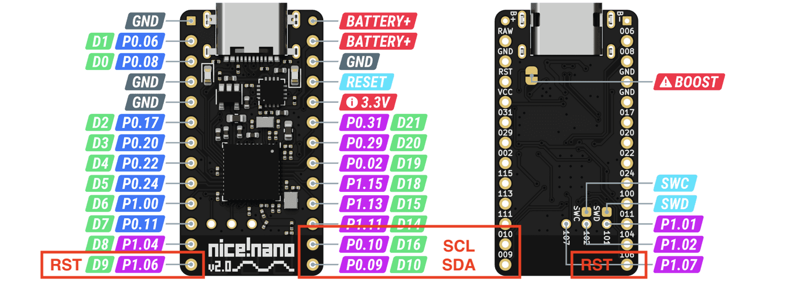
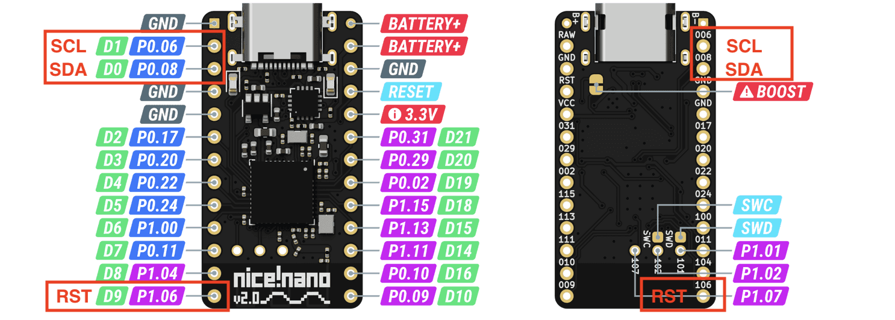
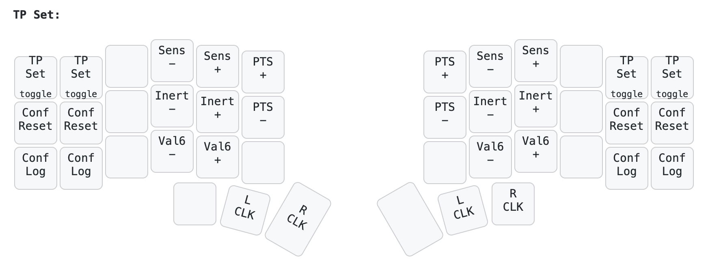
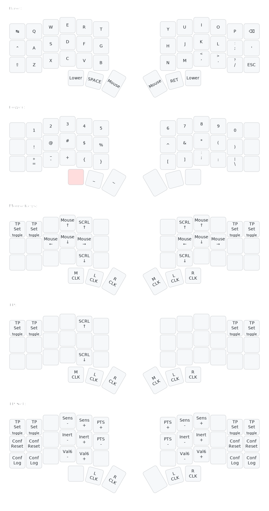

# Example ZMK Config with PS/2 Mouse & TrackPoint Support

This is an example config for my [PS/2 Mouse & TrackPoint zmk module.](https://github.com/infused-kim/kb_zmk_ps2_mouse_trackpoint_driver/).

I encourage you to check out the [commit history](/../../commits/) to see how to create your own config step-by-step.

I added A LOT of comments throughout the config files to help you understand how all the config settings work.

You can also learn more in the README of the [driver module repo](https://github.com/infused-kim/kb_zmk_ps2_mouse_trackpoint_driver/).

## Table Of Contents <!-- omit from toc -->

- [1. Pre-built firmware](#1-pre-built-firmware)
    - [1.1. Low-frequency pins, but compatible with all corne keyboards](#11-low-frequency-pins-but-compatible-with-all-corne-keyboards)
    - [1.2. High-frequency pins, but NOT compatible with all Corne variations](#12-high-frequency-pins-but-not-compatible-with-all-corne-variations)
- [2. How to adjust Tackpoint settings](#2-how-to-adjust-tackpoint-settings)
- [3. Keymap](#3-keymap)
- [4. Related Resources](#4-related-resources)

## 1. Pre-built firmware

In the [releases section](/../../releases/), you can find a pre-compiled firmware that is confirmed to be working.

You can use it to test TrackPoints either on a real corne keyboard or on a breadboard.

The firmware is built for a corne keyboard and I have included two versions with two different TrackPoint pin configurations.

On the nrf52 microchip that the nice!nano uses, pins can be either high or low frequency.

You can find out which pins are high or low in the [nice!nano pinout schematic](https://nicekeyboards.com/docs/nice-nano/pinout-schematic). High frequency pins have blue boxes and low frequency pins have violet boxes.

PS/2 mouse devices will work on both types of pins, but on low-frequency pins, they may cause Bluetooth interference.

So, it's better to use high-frequency pins. But, unless you are designing a keyboard from scratch, that's not always possible.

So, here are two pre-compiled versions of the firmware that use the following pins...

### 1.1. Low-frequency pins, but compatible with all corne keyboards

The original corne version uses all high-frequency pins for the row columns, display, and under glow.

So, the default config in this repo uses the available low-frequency pins:

- **SCL:** D16
- **SDA:** D10
- **Power-On-Reset:** D9



### 1.2. High-frequency pins, but NOT compatible with all Corne variations

There are many keyboards that are based on the Corne and use its pin configuration for display and key matrix, but don't have the under glow.

For example, the Chocofi.

With those keyboards, you can use the following pins for your PS/2 mouse or TrackPoint:

- **SCL:** D1
- **SDA:** D0
- **Power-On-Reset:** D9



## 2. How to adjust Tackpoint settings

TrackPoints have various settings that can change the algorithm for the mouse movement, but recompiling and reflashing your keyboard to test them is very tedious.

So, I added the ability to adjust these settings at run-time through key behaviors, such as `&mms MS_TP_SENSITIVITY_INCR`. This way you can easily find the right settings for your keyboard and preference.

This firmware config includes a layer for TrackPoint settings that you can activate like this...

- Hold the inner thumb to activate the mouse keys layer
- Press the outer, top key on either side of the keyboard to switch to the TrackPoint settings layer
- Let go of the inner thumb key

Now you can adjust the following settings:



- Sensitivity
- Negative Inertia
- Transfer Function Upper Plateau Speed (value6)
- The pressure sensitivity for press-to-select (PTS)

Read the [TrackPoint System Version 4.0 Engineering Specification](https://blogs.epfl.ch/icenet/documents/Ykt3Eext.pdf) to better understand how these settings affect the mouse behavior.

The settings will be saved on the flash of the device after 60 seconds (to prevent excessive wear of the flash chip). So, when you restart the device, the settings will be restored.

But, since some people prefer a more explicit form of configuration, you can also set these settings in [config/include/mouse_tp.dtsi](/config/include/mouse_tp.dtsi#L100).

You can press the `Conf Log` button on the TP settings layer and the keyboard will output your current settings to the log like this:

```log
[00:01:03.027,191] <inf> zmk: Setting trackpoint sensitivity to 135
[00:01:03.044,494] <inf> zmk: Successfully set TP sensitivity to 135
[00:01:21.146,392] <inf> zmk: Current settings...
&mouse_ps2_conf = {
    tp-sensitivity = <135>;
    tp-neg-inertia = <6>;
    tp-val6-upper-speed = <182>;
    tp-tp-press-to-select-threshold = <9>;
}
```

Please refer to [this zmk documentation on how to read USB logs](https://zmk.dev/docs/development/usb-logging#viewing-logs).

You can then copy these settings into your config.

## 3. Keymap



The image was generated using [caksoylar's awesome keymap-drawer](https://github.com/caksoylar/keymap-drawer) and you can update it using the shell script in [./keymap_img/](keymap_img/).

## 4. Related Resources

- [My personal, more advanced zmk-config](https://github.com/infused-kim/zmk-config)
- [PS/2 Mouse & TrackPoint driver module for zmk](https://github.com/infused-kim/kb_zmk_ps2_mouse_trackpoint_driver)
- [Zmk PR #2027: Mouse pointer movement/scrolling](https://github.com/zmkfirmware/zmk/pull/2027)
- [Zmk PR #1751: Add PS/2 Mouse / TrackPoint / Trackpad / Trackball support](https://github.com/zmkfirmware/zmk/pull/1751)
